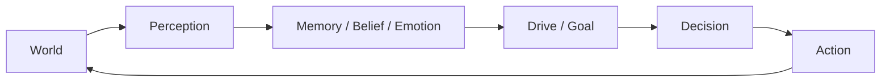
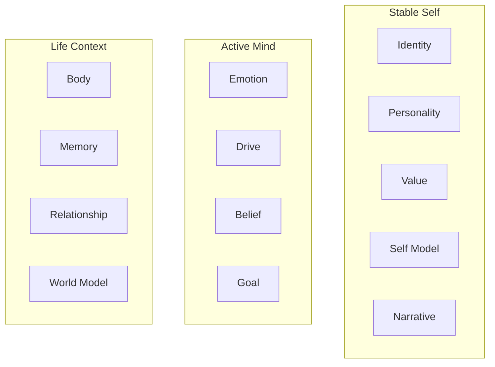
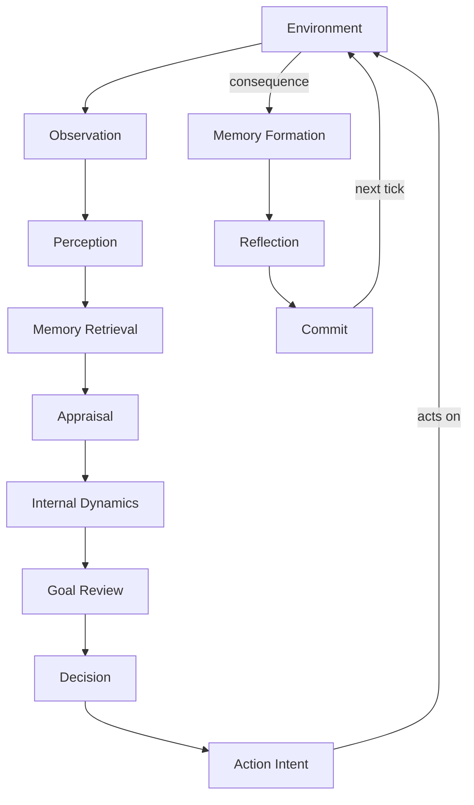
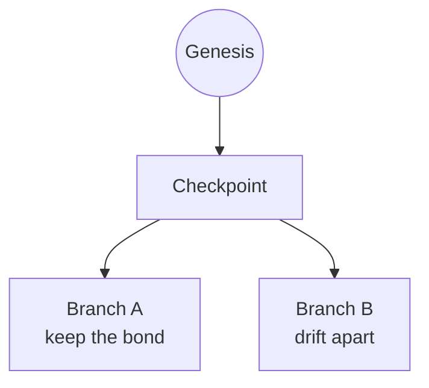

<div align="center">

[English](README.md) · [中文](README.zh-CN.md)

</div>

---

<div align="center">

# AnimaFlux · 灵演

> **An Open Runtime for Evolving Digital Life**
>
> **让 AI 活着，而不只是回答。**

[](https://www.python.org/)
[](https://github.com/erlengzi-code/AnimaFlux)
[](LICENSE)
[]()
[](https://github.com/erlengzi-code/AnimaFlux)

</div>

---

## What is AnimaFlux?

AnimaFlux is an experimental open-source runtime for building **persistent, evolving digital lives**.

Traditional LLM agents are built around a single task:

```text
Input → Reason → Tool → Output
```

AnimaFlux asks a different question:

> **What happens when an AI doesn't just complete a task, but keeps living?**

An AnimaFlux Life has its own time, body, memory, emotion, belief, goal, relationship, self-model and life narrative. It is shaped by the world — and it acts back on the world through its own choices.



So the core is not `Prompt + LLM`, but:

```text
Digital Life = LLM + State + Memory + Dynamics + Time + Environment
```

---

## Why AnimaFlux?

LLMs are great at understanding, reasoning and generating language. But a long-lived digital life also needs **time, state, memory, growth, causality, relationships, goals, actions and history**.

If all of that lives inside one ever-growing prompt, you quickly hit:

- context growing without bound
- memory mixed up with chat history
- personality that can't evolve stably
- state you can't trace
- history you can't replay
- futures you can't compare

AnimaFlux's answer:

> **LLM is cognition. The runtime owns the life.**

---

## Core Life Model

AnimaFlux defines **13 core life states** (frozen in v0.1):



Each answers a distinct question:

| State | Question it answers |
| --- | --- |
| Identity | Who am I, objectively? |
| Body | What is my body / physiology? |
| Personality | How do I tend to react? |
| Emotion | How do I feel right now? |
| Drive | What is motivating me? |
| Memory | What do I remember? |
| Belief | Which propositions do I hold to be true? |
| Value | What matters to me? |
| Goal | What future do I want? |
| Relationship | What is my relationship to others? |
| World Model | How do I structure the world? |
| Self Model | Who do I think I am? |
| Narrative | How do I explain my own life? |

These are **not one big JSON**. Each state has its own owner, update rules, evidence sources, and rate of change.

On top of these, **6 core cognitive processes** run each tick:

```text
Perception · Memory Retrieval · Appraisal · Decision-Planning · Communication · Reflection
```

---

## Life Loop

A life advances through discrete `Tick`s:



Every tick produces a new, persisted life state.

---

## Subjective Reality

AnimaFlux holds a strict boundary:

```text
Reality ≠ Perception ≠ Memory ≠ Belief ≠ World Model ≠ Narrative
```

What the world knows is not what the agent knows. Example:

```text
Objective reality: Alex didn't reply because he's busy at work.
Agent observation:  Alex hasn't replied in 36 hours.
Agent belief:       "Is he pulling away from me?"
```

That belief may be wrong — but if it comes from what the agent actually observed and experienced, it is a **legitimate subjective state**. "Doesn't know" is not "doesn't remember", and both are testable.

---

## Memory Is Not Chat History

AnimaFlux never uses a full chat transcript as its memory system. Memory is an independent long-term life system:

```text
Episodic · Semantic · Procedural · Autobiographical
```

And:

```text
Event ≠ Memory
Stored Memory ≠ Retrieved Memory
Forgetting ≠ Delete
```

Each cognitive step retrieves only a limited, relevant, budgeted slice of memory.

---

## Growth & Experience

No `experience_level = 8` or `maturity = 75%`. AnimaFlux separates:

```text
Age ≠ Experience ≠ Skill ≠ Self-Efficacy
```

And experience is **domain-specific** (`public_speaking`, `research`, `relationship.conflict`, …). So the same life, years later, facing a similar event, may have more relevant memory, lower novelty, more mature procedural experience, and a different sense of self-efficacy — without the system ever assuming "older = more mature".

---

## Agency

A life is not a passive reactor. It supports both:

```text
World → Life        (perception)
Life → Action → World   (agency)
```

A life can act on its own Drive, Goal, Belief, Memory, Relationship and World Model:

```text
Goal:     prepare tomorrow's research talk
Memory:   asking for feedback early helped last time
Decision: proactively seek a mentor's feedback
Action:   seek_feedback
```

The environment decides whether the world allows it and what actually results.

> **The world shapes the life, and the life acts back on the world.**

---

## Replay & Life Branches

Three strictly distinct time semantics:

```text
RESTORE   continue a past life
REPLAY    read-only replay of what already happened (zero LLM calls)
BRANCH    fork a new future from the past
```



Branches share the pre-fork past and evolve independent futures — so you can study *"what if the life had chosen differently?"*

---

## Causal Trace — "Why?"

Every important behavior can answer **why**. Source references, evidence and provenance are recorded through the pipeline:

```text
Why did the life reach out to Alex?
  Drive   → connection
  Goal    → maintain an important relationship
  Memory  → long silence caused distance before
  Belief  → proactive contact may help
  Decision → contact Alex
  Action  → message sent
```

This is a runtime causal chain built from real state — not an explanation the LLM invents afterwards.

---

## Architecture

```text
Microkernel + State Owners + Cognitive Processes + Persistence + Environment Adapters
```

Dependency direction:

```text
Application → Public API → Runtime → Kernel / Contracts
```

Plugins may only read another module's **public capability** (an immutable view) and request changes via **influence** — never write another module's state directly. The core rule:

> **Each module interprets its own state; others may only propose influence; the runtime commits the final state.**

This is enforced by 13 architecture-regression tests (owner isolation, capability immutability, transaction rollback, replay exactness, branch isolation, knowledge boundary, …).

---

## Persistence

Default backend is **SQLite** (an in-memory backend is also provided), built on:

```text
Immutable State Versions + Copy-on-Write + Commit Journal + Checkpoint
```

State is never overwritten — new versions are appended, the current pointer advances last. That is what makes restore, replay, branch and causal trace possible.

---

## Local Web Console

A local observatory, built on **FastAPI + vanilla JavaScript**, and nothing more than another consumer of the public API:

```text
Browser → FastAPI → AnimaFlux Public API → Runtime
```

It never touches `StateStore` / `StateOwner` / `Resolver` / DB internals directly. Views include **Life · Talk · Timeline · Mind · Branches**, for watching a life's current state, conversation, memory, relationships, growth, history and branches.

---

## Project Philosophy

```text
LLM is cognition, not the runtime.
State is not prompt text.
Memory is not chat history.
Objective reality is not subjective belief.
Age is not experience.
Experience is not skill.
Reflection does not directly mutate the world.
Action does not guarantee success.
Replay does not create a new future.
Branching never rewrites the past.
```

And:

> **A digital life should not only remember what happened to it. It should become different because it lived through it.**

---

## Quick Start

Requires Python 3.10+. Create a virtualenv and install:

```bash
git clone https://github.com/erlengzi-code/AnimaFlux.git
cd AnimaFlux

python -m venv .venv
# Windows: .venv\Scripts\activate      Linux/Mac: source .venv/bin/activate

pip install -e ".[dev]"     # core + web + test tooling
```

Run the test suite:

```bash
pytest        # 300 passed, 1 skipped (the skip is an opt-in live-LLM smoke test)
```

Run the official demos (a multi-day growth arc, a relationship fork, four lives/four deaths):

```bash
python -m animaflux demo
```

Start the local web console:

```bash
pip install -e ".[web]"
python -m animaflux web --open        # or double-click start_web.bat on Windows
```

Minimal Python API:

```python
from animaflux.api import AnimaFlux, CharacterBootstrap

flux = AnimaFlux()
life = flux.create_life("life-1", bootstrap=CharacterBootstrap(primary_name="Lin"))

life.observe_text("You have a chance to give your first public talk next week.")
for _ in range(6):
    life.advance(86400.0)
    life.act()

life.checkpoint()
```

---

## Documentation

| Document | Contents |
| --- | --- |
| [技术架构设计规范 v5.9](AnimaFlux_技术架构设计规范_v5.9_FINAL.md) | Full technical spec (authoritative, Chinese) |
| [设计规范·持续维护版](AnimaFlux_设计规范_持续维护版_FINAL.md) | Quick-reference summary |
| [GATES.md](GATES.md) | P0–P12 phase acceptance criteria |
| [TRACEABILITY.md](TRACEABILITY.md) | Spec section → module → test mapping |
| [FUNCTIONAL_TEST_REPORT.md](FUNCTIONAL_TEST_REPORT.md) | 20 end-to-end "life slice" scenarios |
| [CLAUDE.md](CLAUDE.md) | Project development constraints |

---

## Project Status

**v0.1 is frozen and implemented.** The architecture is frozen (`FROZEN FOR IMPLEMENTATION`) — 13 states + 6 processes are fixed, and new features go to the v0.2 backlog rather than expanding the core. It remains an experimental research/engineering project; APIs may still change.

---

## Repository Structure

```text
src/animaflux/
├── contracts/      # framework contracts (Protocol / dataclass / Enum)
├── kernel/         # mechanism kernel (time, random, plugin, scheduler)
├── runtime/        # life loop, resolver, transaction, replay, branch
├── state/          # versioned state store
├── plugins/
│   ├── default_life/       # 12 core-state owners
│   └── default_cognition/  # 6 cognitive processes
├── memory/         # the one mandatory specialized store
├── persistence/    # SQLite + in-memory backends
├── llm/            # optional provider + call strategy
├── environment/    # environment adapter / scenarios
├── web/            # local web console
└── cli/            # command line
```

---

## Roadmap

v0.1 deliberately models **the life, not the universe** — the world arrives through an *environment adapter*, not a full simulation. Future directions include:

```text
World Runtime          persistent world dynamics beyond single scenarios
Pluggable Worlds       novel / historical / game worlds via a structured world spec
Novel / World Importer generate a structured world from source material
Multi-Life Interaction independent lives sharing one world
Research Tools         replay / branch / causal comparison
Visualization          richer life timeline and world UI
```

The goal is not a giant feature set. It is to answer one question well:

> **What does it take for an AI to have a life instead of only a conversation?**

---

## Contributing

Interesting areas include state models, cognitive processes, memory retrieval, environment adapters, LLM providers, scenarios, replay/branch tooling and visualization.

Keep one architectural rule in mind:

> **Do not bypass the runtime to directly mutate another module's state.**

---

## Disclaimer

AnimaFlux is an experimental simulation framework. The built-in life models are engineering abstractions inspired by cognitive and agent-system concepts — **not a scientific model of human psychology**. Third-party worlds, novels, characters or datasets should only be used with the appropriate rights or permissions.

---

## License

[MIT](LICENSE) © 2026 erlengzi-code

---

<p align="center">

**AnimaFlux · 灵演**

*Let AI live, not just answer.*

</p>
