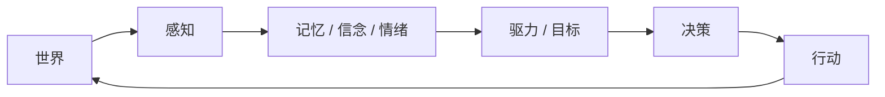
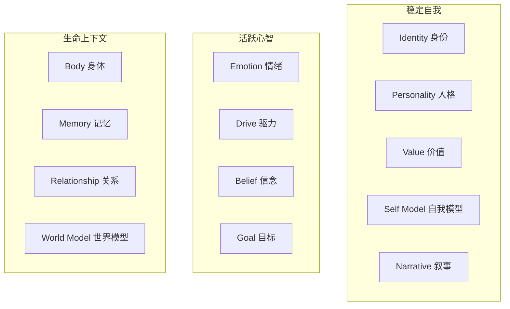
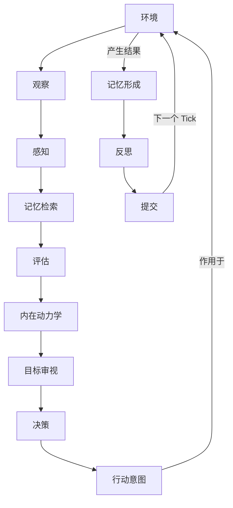
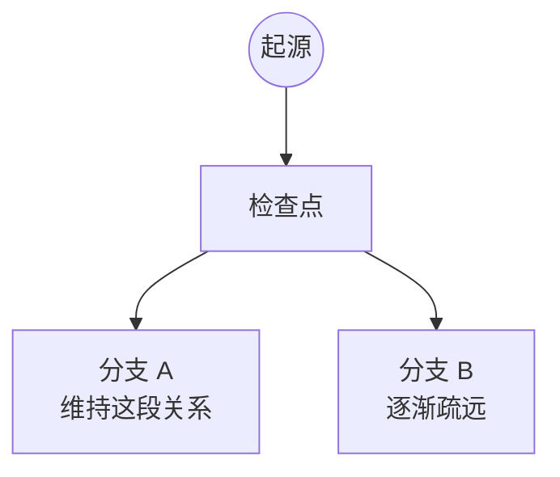

<div align="center">

[English](README.md) · [中文](README.zh-CN.md)

</div>

---

<div align="center">

# AnimaFlux · 灵演

> **An Open Runtime for Evolving Digital Life**
>
> **让 AI 活着，而不只是回答。**

[](https://www.python.org/)
[](https://github.com/erlengzi-code/AnimaFlux)
[](LICENSE)
[]()
[](https://github.com/erlengzi-code/AnimaFlux)

</div>

---

## 什么是 AnimaFlux？

AnimaFlux 是一个实验性的开源运行时，用于构建**持久存在、不断演化的数字生命**。

传统 LLM Agent 往往围绕一次任务展开：

```text
输入 → 推理 → 工具 → 输出
```

AnimaFlux 关注的是另一个问题：

> **如果一个 AI 不只是完成一次任务，而是持续生活，会发生什么？**

一个 AnimaFlux 生命拥有自己的时间、身体、记忆、情绪、信念、目标、关系、自我认知与人生叙事。它被世界改变，也通过自己的选择反过来影响世界。



所以核心不是 `Prompt + LLM`，而是：

```text
数字生命 = LLM + 状态 + 记忆 + 动力学 + 时间 + 环境
```

---

## 为什么是 AnimaFlux？

LLM 很擅长理解、推理和生成语言。但一个长期存在的数字生命还需要**时间、状态、记忆、成长、因果、关系、目标、行动与历史**。

如果这些都塞进一段越来越长的 Prompt 里，很快会遇到：

- 上下文无限增长
- 记忆与聊天记录混在一起
- 人格无法稳定演化
- 状态不可追踪
- 历史不可重放
- 不同未来无法比较

AnimaFlux 的思路是：

> **LLM 负责认知，Runtime 负责生命。**

---

## 核心生命模型

AnimaFlux 定义了 **13 个核心生命状态**（v0.1 已冻结）：



每个状态回答一个不同的问题：

| 状态 | 它回答的问题 |
| --- | --- |
| Identity | 我客观上是谁？ |
| Body | 我的身体与生理状态如何？ |
| Personality | 我通常倾向怎样反应？ |
| Emotion | 我现在感受如何？ |
| Drive | 什么正在推动我？ |
| Memory | 我记住了什么？ |
| Belief | 我认为哪些事情是真的？ |
| Value | 什么对我来说重要？ |
| Goal | 我希望未来变成什么？ |
| Relationship | 我与别人之间是什么关系？ |
| World Model | 我如何理解这个世界？ |
| Self Model | 我认为自己是谁？ |
| Narrative | 我如何解释自己的人生？ |

它们**不是一个巨大的 JSON**。每个状态都有自己的 Owner、更新规则、证据来源和演化速度。

在这之上，每个 Tick 运行 **6 个核心认知过程**：

```text
Perception 感知 · Memory Retrieval 记忆检索 · Appraisal 评估
Decision-Planning 决策 · Communication 交流 · Reflection 反思
```

---

## 生命循环

一个数字生命通过离散的 `Tick` 持续向前运行：



每一个 Tick 都会形成新的、可持久化的生命状态。

---

## 主观现实

AnimaFlux 非常强调一条边界：

```text
现实 ≠ 感知 ≠ 记忆 ≠ 信念 ≠ 世界模型 ≠ 叙事
```

世界知道的事情，并不意味着 Agent 知道。例如：

```text
客观现实：Alex 没回复，因为正在忙工作。
Agent 观察：Alex 已经 36 小时没有回复。
Agent 信念：「他是不是在疏远我？」
```

这个信念可能是错的 —— 但只要它来自 Agent 真正拥有的信息和经历，它就是一个**合法的主观状态**。「不知道」≠「不记得」，且两者都是可测的。

---

## 记忆不是聊天记录

AnimaFlux 不把完整聊天记录当成记忆。记忆是独立的长期生命系统：

```text
情景记忆 · 语义记忆 · 程序记忆 · 自传记忆
```

并且：

```text
事件 ≠ 记忆
已存储的记忆 ≠ 被检索到的记忆
遗忘 ≠ 删除
```

每次认知过程只会检索有限、相关、有预算的记忆片段。

---

## 成长与阅历

不使用简单的 `experience_level = 8` 或 `maturity = 75%`。AnimaFlux 区分：

```text
年龄 ≠ 阅历 ≠ 能力 ≠ 自我效能
```

而且阅历是**领域相关**的（`public_speaking`、`research`、`relationship.conflict`……）。因此，同一个生命多年后面对类似事件时，可能拥有更多相关记忆、更低的新奇感、更成熟的程序性经验、不同的主观可行性判断 —— 但系统从不简单认为「年龄更大 = 更成熟」。

---

## 主动性

一个生命不是被动的反应器。它同时支持：

```text
世界 → 生命        （感知）
生命 → 行动 → 世界   （主动）
```

一个生命可以基于自己的驱力、目标、信念、记忆、关系和世界模型主动行动：

```text
目标：   准备明天的研究汇报
记忆：   上次提前获得反馈很有帮助
决策：   主动寻找导师反馈
行动意图：seek_feedback
```

环境决定世界是否允许，以及最终发生什么。

> **世界塑造生命，生命也反过来作用于世界。**

---

## 重放与人生分支

三种严格区分的时间语义：

```text
RESTORE   继续过去的人生
REPLAY    只读重放已经发生的人生（零 LLM 调用）
BRANCH    从过去分叉出一个新的未来
```



分支共享分叉前的过去，各自演化独立的未来 —— 于是可以研究 *「如果生命在某个节点做出了不同选择，会发生什么？」*

---

## 因果追溯 —— 「为什么？」

任何重要行为都能回答**为什么**。来源引用、证据与 provenance 贯穿整条管道被记录：

```text
为什么这个生命联系了 Alex？
  Drive 驱力 → 联结
  Goal 目标 → 维持一段重要关系
  Memory 记忆 → 长期的沉默曾经造成疏远
  Belief 信念 → 主动联系可能有帮助
  Decision 决策 → 联系 Alex
  Action 行动 → 消息已发送
```

这是一条由真实状态构建的运行时因果链 —— 而不是让 LLM 事后编造一个解释。

---

## 架构

```text
微内核 + 状态 Owner + 认知过程 + 持久化 + 环境适配器
```

依赖方向：

```text
应用 → 公开 API → Runtime → Kernel / Contracts
```

插件只能读取其他模块的**公开能力（不可变 View）**，并通过 **Influence** 请求改变状态 —— 绝不能直接写别人的状态。核心规则：

> **自己的状态自己解释；别人的状态只能提出影响；最终状态由 Runtime 统一提交。**

这条规则由 13 条架构回归测试强制保证（Owner 隔离、能力不可变、事务回滚、重放精确、分支隔离、知识边界……）。

---

## 持久化

默认后端是 **SQLite**（同时提供内存后端），构建于：

```text
不可变状态版本 + 写时复制 + 提交日志 + 检查点
```

状态从不被覆盖 —— 新版本追加写入，当前指针最后才前进。这正是 Restore / Replay / Branch / 因果追溯得以实现的基础。

---

## 本地 Web 观察舱

基于 **FastAPI + 原生 JavaScript** 构建的本地观察界面，本质上只是公开 API 的另一个消费者：

```text
浏览器 → FastAPI → AnimaFlux 公开 API → Runtime
```

它从不直接访问 `StateStore` / `StateOwner` / `Resolver` / 数据库内部。视图包括 **Life · Talk · Timeline · Mind · Branches**，用来直观观察一个生命的当前状态、对话、记忆、关系、成长、历史与分支。

---

## 项目哲学

```text
LLM 是认知，不是运行时。
状态不是 Prompt 文本。
记忆不是聊天记录。
客观现实不是主观信念。
年龄不是阅历。
阅历不是能力。
反思不直接改变世界。
行动不保证成功。
重放不创造新未来。
分支永不改写过去。
```

以及：

> **一个数字生命不该只记得发生在自己身上的事。它应该因为经历过，而变得不同。**

---

## 快速开始

需要 Python 3.10+。创建虚拟环境并安装：

```bash
git clone https://github.com/erlengzi-code/AnimaFlux.git
cd AnimaFlux

python -m venv .venv
# Windows: .venv\Scripts\activate      Linux/Mac: source .venv/bin/activate

pip install -e ".[dev]"     # 核心 + Web + 测试工具
```

运行测试：

```bash
pytest        # 300 passed, 1 skipped（skip 是需真实 LLM 密钥 opt-in 的 smoke 测试）
```

运行官方 Demo（多日成长弧线、关系转折分支、四条生命四种死法）：

```bash
python -m animaflux demo
```

启动本地 Web 观察舱：

```bash
pip install -e ".[web]"
python -m animaflux web --open        # Windows 下也可双击 start_web.bat
```

最小 Python API：

```python
from animaflux.api import AnimaFlux, CharacterBootstrap

flux = AnimaFlux()
life = flux.create_life("life-1", bootstrap=CharacterBootstrap(primary_name="小林"))

life.observe_text("你有机会在下周进行第一次公开演讲。")
for _ in range(6):
    life.advance(86400.0)
    life.act()

life.checkpoint()
```

---

## 文档

| 文档 | 内容 |
| --- | --- |
| [技术架构设计规范 v5.9](AnimaFlux_技术架构设计规范_v5.9_FINAL.md) | 完整技术规范（权威） |
| [设计规范·持续维护版](AnimaFlux_设计规范_持续维护版_FINAL.md) | 速查摘要 |
| [GATES.md](GATES.md) | P0–P12 阶段验收清单 |
| [TRACEABILITY.md](TRACEABILITY.md) | 文档章节 → 模块 → 测试 映射 |
| [FUNCTIONAL_TEST_REPORT.md](FUNCTIONAL_TEST_REPORT.md) | 20 个端到端「生命切片」场景 |
| [CLAUDE.md](CLAUDE.md) | 项目开发约束 |

---

## 项目状态

**v0.1 已冻结并实现。** 架构处于冻结状态（`FROZEN FOR IMPLEMENTATION`）—— 13 个状态 + 6 个过程已固定，新功能进 v0.2 backlog 而非扩展核心。它仍是一个实验性的研究/工程项目，API 仍可能调整。

---

## 目录结构

```text
src/animaflux/
├── contracts/      # 框架契约（Protocol / dataclass / Enum）
├── kernel/         # 机制内核（时间、随机、插件、调度）
├── runtime/        # 生命循环、裁决器、事务、重放、分支
├── state/          # 版本化状态存储
├── plugins/
│   ├── default_life/       # 12 个核心状态 Owner
│   └── default_cognition/  # 6 个认知过程
├── memory/         # 唯一强制专用存储
├── persistence/    # SQLite + 内存双后端
├── llm/            # 可选 Provider + 调用策略
├── environment/    # 环境适配器 / 场景
├── web/            # 本地 Web 观察舱
└── cli/            # 命令行
```

---

## 路线图

v0.1 刻意只模拟**生命本身，而不是宇宙** —— 世界通过*环境适配器*接入，而非完整模拟。未来方向包括：

```text
World Runtime          超越单个场景的持久世界动力学
Pluggable Worlds       通过结构化世界设定接入小说 / 历史 / 游戏世界
Novel / World Importer 从原始素材生成结构化世界
Multi-Life Interaction 共享同一世界的多个独立生命
Research Tools         重放 / 分支 / 因果对比
Visualization          更丰富的生命时间线与世界 UI
```

目标不是尽快堆出巨大功能集，而是回答好一个问题：

> **让一个 AI 拥有「人生」而不是只有「对话」，需要什么？**

---

## 参与贡献

有趣的方向包括：状态模型、认知过程、记忆检索、环境适配器、LLM Provider、场景、重放/分支工具与可视化。

请牢记一条架构规则：

> **不要绕过 Runtime 直接修改另一个模块的状态。**

---

## 免责声明

AnimaFlux 是一个实验性的模拟框架。内置的生命模型是受认知与智能体系统概念启发的**工程抽象，并非人类心理学的科学模型**。第三方世界、小说、角色或数据集只应在拥有相应权利或授权时使用。

---

## 许可证

[MIT](LICENSE) © 2026 erlengzi-code

---

<p align="center">

**AnimaFlux · 灵演**

*让 AI 活着，而不只是回答。*

</p>
